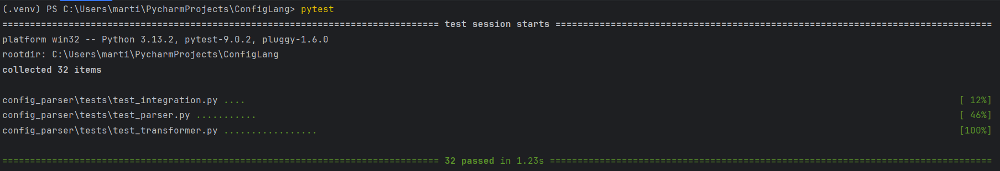

# ConfigLang — Компилятор учебного конфигурационного языка в JSON

ConfigLang — это инструмент командной строки, преобразующий конфигурации на учебном языке в формат JSON с поддержкой вычислений на этапе компиляции, вложенных структур и Unicode.

# Особенности
1. Типизированные конфигурации: поддержка чисел, строк, вложенных структур
2. Константы времени компиляции: объявление и использование констант
3. Постфиксные выражения: математические операции (+, -, *, /), функции (mod, sqrt)
4. Многострочные комментарии: <# ... #>
5. Строгая типизация: имена идентификаторов начинаются с заглавной буквы или _
6. Отладка ошибок: детальные сообщения с указанием позиции синтаксических ошибок

# Установка
1. Клонируйте репозиторий
```bash
git clone https://github.com/eriicyaan/ConfigureMirea2.git
```
2. Создайте виртуальное окружение(по желанию)

``` bash
python -m venv .venv
source .venv/bin/activate  # Linux/MacOS
# или
.venv\Scripts\activate # Windows
```

# Использование
```bash

Get-Content ./config_parser/tests\examples\<input-file> | python -m config_parser.cli -o <output-file> # для powershell
python -m config_parser.cl -o <output-file> < ./config_parser/tests\examples\<input-file> # для cmd
```

# Примеры конфигураций

```
<#
Basic configuration example
#>

MAX_CONNECTIONS := 100;
TIMEOUT := 30;

struct {
    Server = struct {
        Host = "localhost",
        Port = 8080,
        Max_connections = MAX_CONNECTIONS,
        Settings = struct {
            Timeout = TIMEOUT
        }
    }
}
```
Результат в JSON

```json
[
  {
    "Server": {
      "Host": "localhost",
      "Port": 8080.0,
      "Max_connections": 100.0,
      "Settings": {
        "Timeout": 30.0
      }
    }
  }
]
```

# Тестирование
Каждый .py файл покрыт тестами, с использованием библиотеки pytest

```bash
# Запуск всех тестов
pytest
# Запуск конкретного тест-файла
pytest <Путь до .py тест файла>
# Запуск конкретного тест-класса
pytest <Путь до .py тест файла>::<Название класса>
# Запуск конкретного тест-метода
pytest <Путь до .py тест файла>::<Название класса>::<Название метода>

```

# Структура проекта
```
config_parser/
├── cli.py                    # Точка входа CLI
├── parser.py                 # Парсер на основе Lark
├── transformer.py            # Трансформер для вычислений
├── __init__.py              # Инициализация пакета
├── tests/                   # Тесты
│   ├── __init__.py
│   ├── test_parser.py       # Тесты парсера
│   ├── test_transformer.py  # Тесты трансформера
│   ├── test_cli.py          # Тесты CLI
│   ├── test_integration.py  # Интеграционные тесты
│   ├── test_examples.py     # Тесты примеров
│   └── examples/            # Примеры конфигураций
│       ├── basic.conf
│       ├── character.conf
│       ├── game.conf
│       ├── math.conf
│       ├── nested.conf
│       ├── physics.conf
│       └── server.conf
└── result/                  # Результаты преобразования
    ├── basic.json
    ├── character.json
    ├── game.json
    ├── math.json
    ├── nested.json
    ├── physics.json
    └── server.json
```

# Результат запуска всех тестов

```commandline
pytest
```

